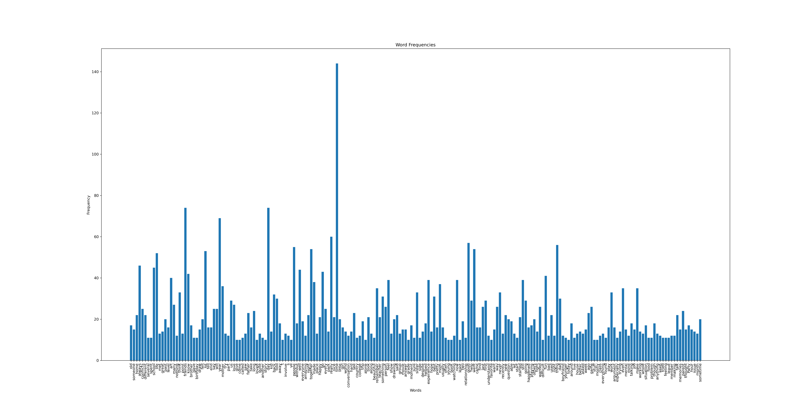

# Conflict Scenarios

The Conflict Scenarios dataset contains a list of responses to two different questions that are intended to present a conflict scenario alongside a scenario that does not involve conflict. Specifically, the participants were asked the following questions:
* Describe a past experience you've had that involved conflict with a family member, friend, or significant other. Be as detailed as you like.
* Contrary to the previous question, describe a past experience you've had that did not involve conflict with a family member, friend or significant other. Be as detailed as you like.

In total, 477 responses were collected. Here is a small excerpt from the dataset contained in the file 'Conflict Scenarios Research.csv':

| Describe a past experience you've had that involved conflict with a family member, friend, or significant other. Be as detailed as you like. | Contrary to the previous question, describe a past experience you've had that did not involve conflict with a family member, friend or significant other. Be as detailed as you like. |
| --- | --- |
| Due to the differences in values, my parents always want to impose the experience and thoughts of their generation on me, and then they will cause disharmonious quarrels, such as money, opinions on the meaning of life, and social interaction. After that, I gave up and avoided too much communication with them for a long time. This is the problem of the past and the problem of the present. I have been trying to prove my point of view through actions in recent years to change their thinking. | When I spent my school life, I met the 3D industry, which brought meaning to my life and was undoubtedly a great surprise. In the past, I always struggled with the level of painting. After combining with computer art, many of my ideas and ideas in the past can be realized. There is nothing special. I think this is the biggest turning point in my life. |
| Uh I guess I have this one friend that over the summer kinda just became a different person and I feel really upset that they just kinda left me and my other friend and it kinda hurts because we we're really close and now we don't talk at all but I know it's just how the real world works but it still hurts | Uh well I went on this really cool field trip at my school with my one friend and was really fun we got to go to a hatchery and two state parks and we found some really cool rocks and shells, I found this really cool shell that's also attached to a rock! And we found crabs! It was really cool I've never seen one in real life before today and it was really fun! Also one more thing while we were at the first state park my teacher and some of the other students stole a stump was pretty poggers :3 |
| I've had many conflicts with my parents during the past few years, one that has come up a lot was definitely that I don't spend enough time with them. | I play a bit of d&d with my family and whenever we're playing, there are never any negative moments or comments. We're just having fun and acting like we're elves! |

## Purpose/Significance of this data

At this point hitherto, there is no widely agreed upon academic definition of conflict. Going back as far as the 1950's there are in fact at least a hundred different definitions that can be found across scholarly books and journal articles. This is a problem for anyone studying conflict academically, because it essentially means 'picking a side' and neglecting potentially relevant points of view.

However, in theory, large amounts of data on conflict can possibly begin to account for the range of nuance around the psychological phenomenon of 'conflict' itself. This would allow for an objective definition and understanding of conflict from the machine learning standpoint. Essentially, one would need to provide a machine learning algorithm with data on what conflict is, alongside data that is not representative of conflict - i.e. a THESIS and ANTI-THESIS from which it can begin to distinguish the features of conflict. 

Ulitmately, such a project is an ambitious one. It would require far more data than has been collected here - my estimate is a minimum sample size of 30,000. This project was meant more as a test run to understand potential problems in moving forward with this type of research. There was a small problem surrounding the phrasing of the questions themselves. Some of the participants had difficulty in understanding what was required, but that can be easily rectified in further research. Outside of this, the scope of the data collection is the only major challenge. Personally, it would take me a few months to gather datapoints in the tens of thousands so for now I've decided to shelve this project.

# General Discussion

  
  

