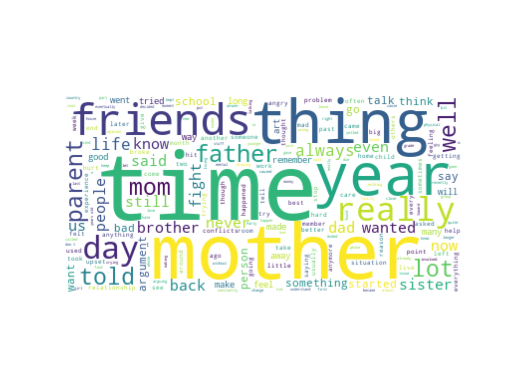
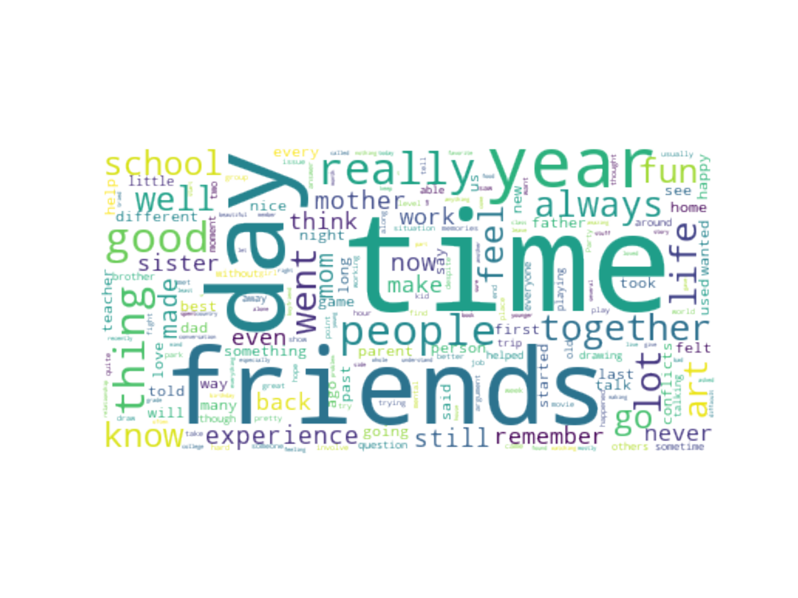

# Conflict Scenarios

The Conflict Scenarios dataset contains a list of responses to two different questions that are intended to present a conflict scenario alongside a scenario that does not involve conflict. Specifically, the participants were asked the following questions:
* Describe a past experience you've had that involved conflict with a family member, friend, or significant other. Be as detailed as you like.
* Contrary to the previous question, describe a past experience you've had that did not involve conflict with a family member, friend or significant other. Be as detailed as you like.

In total, 477 responses were collected. Here is a small excerpt from the dataset contained in the file 'Conflict Scenarios Research.csv':

| Describe a past experience you've had that involved conflict with a family member, friend, or significant other. Be as detailed as you like. | Contrary to the previous question, describe a past experience you've had that did not involve conflict with a family member, friend or significant other. Be as detailed as you like. |
| --- | --- |
| Due to the differences in values, my parents always want to impose the experience and thoughts of their generation on me, and then they will cause disharmonious quarrels, such as money, opinions on the meaning of life, and social interaction. After that, I gave up and avoided too much communication with them for a long time. This is the problem of the past and the problem of the present. I have been trying to prove my point of view through actions in recent years to change their thinking. | When I spent my school life, I met the 3D industry, which brought meaning to my life and was undoubtedly a great surprise. In the past, I always struggled with the level of painting. After combining with computer art, many of my ideas and ideas in the past can be realized. There is nothing special. I think this is the biggest turning point in my life. |
| Uh I guess I have this one friend that over the summer kinda just became a different person and I feel really upset that they just kinda left me and my other friend and it kinda hurts because we we're really close and now we don't talk at all but I know it's just how the real world works but it still hurts | Uh well I went on this really cool field trip at my school with my one friend and was really fun we got to go to a hatchery and two state parks and we found some really cool rocks and shells, I found this really cool shell that's also attached to a rock! And we found crabs! It was really cool I've never seen one in real life before today and it was really fun! Also one more thing while we were at the first state park my teacher and some of the other students stole a stump was pretty poggers :3 |
| I've had many conflicts with my parents during the past few years, one that has come up a lot was definitely that I don't spend enough time with them. | I play a bit of d&d with my family and whenever we're playing, there are never any negative moments or comments. We're just having fun and acting like we're elves! |

# General Discussion

At this point hitherto, there is no widely agreed upon academic definition of conflict. Going back as far as the 1950's there are in fact at least a hundred different definitions that can be found across scholarly books and journal articles. This is a problem for anyone studying conflict academically, because it essentially means 'picking a side' and neglecting potentially relevant points of view.

However, in theory, large amounts of data on conflict can possibly begin to account for the range of nuance around the psychological phenomenon of 'conflict' itself. This would allow for an objective definition and understanding of conflict from the machine learning standpoint. Essentially, one would need to provide a machine learning algorithm with data on what conflict is, alongside data that is not representative of conflict - i.e. a THESIS and ANTI-THESIS from which it can begin to distinguish the features of conflict. This project collected data a bit narrowly within the scope of interpersonal conflict - serious research in this vein would have the trouble of accomodating a much broader dataset. Instead of asking participants about interpersonal conflict, the questions would instead be posed broadly around the concept of conflict itself, leaving the interpersonal/intrapersonal boundaries up to the interpretation of the participants themselves.

Ulitmately, such a project is an ambitious one. It would require far more data than has been collected here - my estimate is a minimum sample size of 30,000. This project was meant more as a test run to understand potential problems in moving forward with this type of research. There was a small problem surrounding the phrasing of the questions themselves. Some of the participants had difficulty in understanding what was required, but that can be easily rectified in further research. Outside of this, the scope of the data collection is the only major challenge. Personally, it would take me a few months to gather datapoints in the tens of thousands so for now I've decided to shelve this project.

The following is a wordcloud generated from the text data that describes **CONFLICT** in order to visualize the theme of the responses. On the right, is the word frequency chart associated with the wordcloud image.

  
  

The following is a wordcloud generated from the text data that describes **NON-CONFLICT** in order to visualize the theme of the responses. On the right, is the word frequency chart associated with the wordcloud image.

  
  

There is a lot more that can be said about this data, but among the most notable is the idea that the experience of losing a loved one or significant other (i.e. death), presents itself as source of conflict to a lot of people. The loss of a loved one or significant other can be a direct source of conflict for individuals, as it can lead to intense emotional distress and a range of negative psychological and behavioral outcomes. Grief and mourning can be a complex and deeply personal experience that can affect different people in different ways. Some may experience anger or resentment towards others, blaming them for the loss, while others may feel a sense of isolation and withdrawal from social support. Additionally, the bereaved may experience a lack of control, leading to feelings of helplessness and frustration. These factors, along with a range of other individual and situational factors, can contribute to conflict in relationships and social interactions following the loss of a loved one. It is important for psychological researchers to understand these dynamics to better support individuals and families coping with loss and grief.

## Theoretical Frameworks

Below are a description of a few of the theories and theoretical frameworks that can be applied to conflict research.

### Social Identity Theory
Social Identity Theory: This theory proposes that individuals derive a sense of self-esteem and social identity from their membership in social groups. When conflicts arise, individuals may engage in behaviors that protect their group and elevate their status within it. Developed by Henri Tajfel and John Turner in the 1970s, this theory has been applied to various areas of conflict research, including intergroup conflicts and political polarization.

### Cognitive Dissonance Theory
Cognitive Dissonance Theory: This theory suggests that individuals experience mental discomfort when they hold contradictory beliefs or attitudes. To reduce this discomfort, individuals may change their beliefs, attitudes, or behaviors to align with their current views. Developed by Leon Festinger in the 1950s, this theory has been applied to various areas of conflict research, including attitude change and persuasion.

### Social Learning Theory
Social Learning Theory: This theory proposes that individuals learn behaviors through observation, modeling, and reinforcement. In conflict scenarios, individuals may learn and adopt aggressive behaviors if they are reinforced or rewarded for such behaviors. Developed by Albert Bandura in the 1970s, this theory has been applied to various areas of conflict research, including aggression and violence.

### Attachment Theory
Attachment Theory: This theory suggests that individuals form attachment styles based on their experiences with caregivers in early childhood. These attachment styles can influence individuals' expectations and behaviors in interpersonal relationships. In conflict scenarios, individuals with insecure attachment styles may exhibit maladaptive behaviors, such as withdrawal or aggression. Developed by John Bowlby and Mary Ainsworth in the 1960s, this theory has been applied to various areas of conflict research, including family conflicts and intimate partner violence.

### Social Exchange Theory
Social Exchange Theory: This theory proposes that individuals make decisions based on the costs and benefits of their actions in social interactions. In conflict scenarios, individuals may weigh the potential gains and losses of engaging in or avoiding conflict. Developed by George Homans in the 1950s, this theory has been applied to various areas of conflict research, including interpersonal conflicts and negotiations.

### Equity Theory
Equity Theory: This theory proposes that individuals strive for fairness and balance in their relationships and interactions. When there is a perceived inequity, individuals may experience negative emotions and engage in behaviors to restore balance. Developed by J. Stacy Adams in the 1960s, this theory has been applied to various areas of conflict research, including workplace conflicts and distributive justice.

### Systems Theory
Systems Theory: This theory suggests that conflicts arise due to the interconnectedness of social systems, including families, organizations, and communities. When one part of the system experiences a change or disruption, it can have ripple effects throughout the system. Developed by Ludwig von Bertalanffy in the 1950s, this theory has been applied to various areas of conflict research, including environmental conflicts and family conflicts.

### Chaos Theory
Chaos Theory: This theory proposes that complex systems can exhibit unpredictable and nonlinear behaviors, even when the underlying components are simple and deterministic. In conflict scenarios, seemingly small or insignificant events can have large and unexpected consequences. Developed by Edward Lorenz in the 1960s, this theory has been applied to various areas of conflict research, including political conflicts and social movements.

### Gestalt Theory
Gestalt Theory: This theory proposes that individuals perceive and understand their experiences as a whole, rather than as individual parts. In conflict scenarios, individuals may have difficulty seeing the larger picture and may focus on individual events or actions. Developed by Max Wertheimer in the early 1900s, this theory has been applied to various areas of conflict research, including group conflicts and interpersonal conflicts.

### Conflict Theory
Conflict Theory: This theory suggests that conflicts arise due to social and economic inequalities and power imbalances between different groups. Developed by Karl Marx and Friedrich Engels in the mid-1800s, this theory has been applied to various areas of conflict research, including labor conflicts and political conflicts. Conflict theory posits that conflicts are not inherently bad, but rather can be a catalyst for social change and progress.
