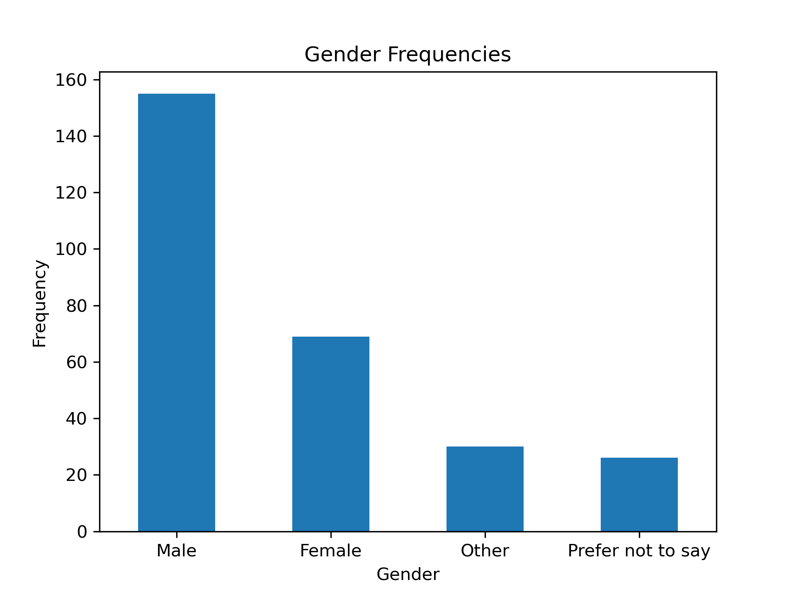
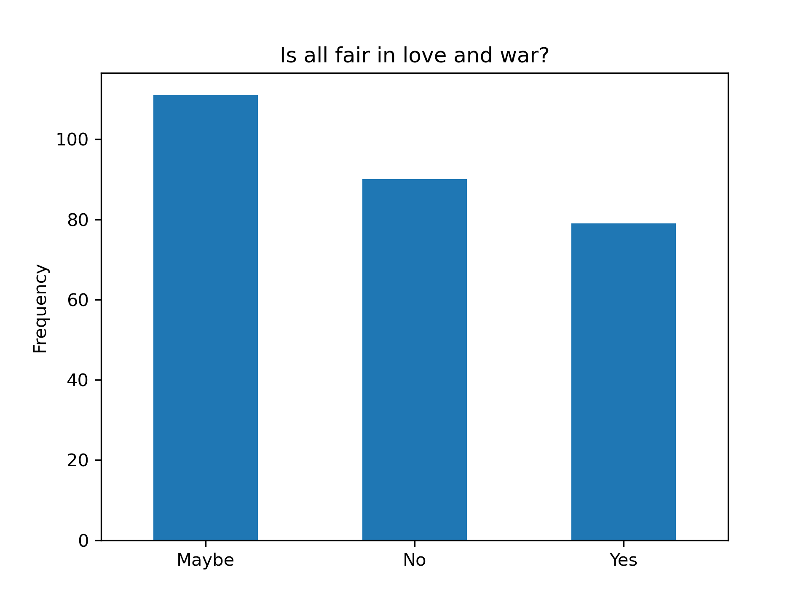
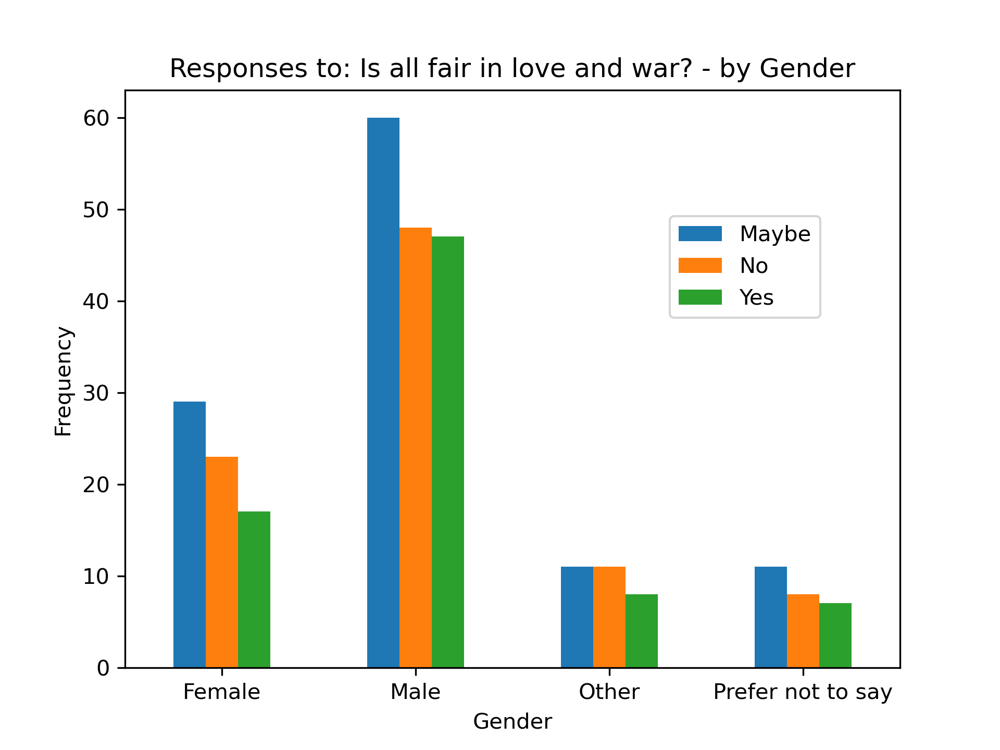

# Love and War

Shakespeare famously said that "all is fair in love and war". I was curious if this was a widely accepted notion among people, so I decided to collect a bit of data. To do this, I asked people very directly what they thought about Shakespeare's statement, and I also posed a complex relationship problem to the participants to ensure that there was genuine reflection being done. A total of 279 responses were collected, and the full dataset is available in the file "Love_and_War.csv". 

The following questions were posed to participants:

* What is your gender?

_The following options were given for gender:_

| Male | Female | Prefer not to say | Other |
| --- | --- | --- | --- |

* Shakespeare famously said, that "all is fair in love and war." Do you agree with this?

_The following options were given:_

| Yes | No | Maybe |
| --- | --- | --- |

* Consider the following situation: John is attracted to a woman named Rebecca. John's friend Mark is also interested in Rebecca. Rebecca is extremely beautiful. If John were to begin a relationship with Rebecca, all of his friends would be envious of him including Mark who has strong feelings for her. There is another problem. John knows that his family would not approve of Rebecca because of her skin color. John is unsure of how to proceed. Rebecca has already indicated that she is attracted to him and if John would like to begin a relationship with her all he has to do is tell her how he feels. What are your thoughts on this situation? (Be as detailed as you like in your response.)

* What are some of the things that people should consider when pursuing a romantic relationship with someone else? (Be as detailed as you like in your response)

Here is a short excerpt from the data collected:

| What is your gender? | Shakespeare famously said, that "all is fair in love and war." Do you agree with this? | Consider the following situation: John is attracted to a woman named Rebecca. John's friend Mark is also interested in Rebecca. Rebecca is extremely beautiful. If John were to begin a relationship with Rebecca, all of his friends would be envious of him including Mark who has strong feelings for her. There is another problem. John knows that his family would not approve of Rebecca because of her skin color. John is unsure of how to proceed. Rebecca has already indicated that she is attracted to him and if John would like to begin a relationship with her all he has to do is tell her how he feels. What are your thoughts on this situation? (Be as detailed as you like in your response.) | What are some of the things that people should consider when pursuing a romantic relationship with someone else? (Be as detailed as you like in your response) |
| --- | --- | --- | --- |
| Male | Maybe | John and Mark should talk it out about since they are both interested in Rebecca to not damage their friendship before John talks to Rebecca. John and Rebecca's relationship should take priority over his family's disapproval, however this may not be possible depending on unknown information. If John still need's his family support to live, either because he is a minor living in their household or cannot financially live on his own, his relationship with Rebecca might need to be secret until he has safe means to live away from his disapproving family. | Romance is complicated. Long distance relationships can be difficult even with internet bridging the gap. How family and friends feel about the relationship. Even things like past relationship history can be a factor in how someone decides to pursue a new romantic relationship. |
| Female | No | I think it's a tough situation for John. It all depends on what he values. If it's his friendship with Mark or his family's validation, then he won't pursue Rebecca. But if he values Rebecca as a person, or as a love interest more, then he'll pursue her. Ultimately, he should choose whatever makes him the most happy, or aligns with his morals more. | To be honest, and I know this isn't completely realistic, all that matter is if you love the other person, and they love you back. People can move mountains for someone they love, romantic or not. As long as both parties have a similar passion and dedication for the other, there's nothing they need to worry about. (Besides death lol) |
| Male | Yes | I think they should be guided by their feelings, not taking into account the opinion of third parties, the two of them being the only constant. | 'complementation', obviously there would be other variants but I think it should be taken into account when looking for a relationship. |
| Female | Maybe | Well... it's hard to choose between the object of love and friendship. But if Jhon and Rebecca realy love each other they should be together  despite what family or society thought. And there is another way: Rebecca can finde another person to build relationships. Not Jhon or Mark | mutual respect, trust, support, understanding,  common interests,  similar views on life |
| Other | No | It is a very difficult situation for John and I feel as though no option would be 100% satisfiable. If he were to confess his feelings towards Rebecca, there would be a high possibility he would lose his connection to his family and his friend. However, if Mark was to abandon his friendship with John, it can be argued that Mark was never a true friend to begin with. It can also be argued that Johns family is also equally as problematic, as skin color should not be a concern for them as long as their child is happy. In the end, John should pick what choice makes him happy, and as his family is already morally questionable, the ultimate decision would be keeping his friend or find love. I personally would suggest that everything considered, John should confess to Rebecca, as there are more upsides to finding love than keeping bad company. | Communication is key. Listen to other people. Don't react when you're in extreme emotions. |
| Male | No | That depends on how old john is. If he risks his relationship with his family without being able to sustain a life by himself it would make life and thus the relationship really hard. If she is "the one" (which i personally think does not exist) go for it. If john has his own household and is not dependent on is family i think that the choice is a no-brainer. Considering the feelings of his friend for his to be girlfriend, it should be talked through with all 3. Maybe they can even form a relationship as a pair of 3. Also if he chooses to go for it, he should NEVER held it against her that he "left his family" for her. Yeah that should cover most of the options xP | That after the early stage it becomes "work" to keep the relationship functioning. If you can't do it don't even bother and discuss this openly. In my opinion you should be able to discuss everything with the person you have romantic feelings for even though the topic might be awkward to tackle. |

# General Discussion

Very few inferences can really be made from this dataset. The most interesting responses came from the relationship problem that I posed to the participants. Having reviewed the data it seems that most people seem to support a relationship between John and Rebecca despite any consequences that might follow; rather, the problems that John may face as a consequence of a relationship with Rebecca is the focal point of the issue _a priori_ to the circumstances themselves. This is interesting as the problem is logically posed to illustrate the only problem as the consequence of the choice that John has to make before a relationship can begin. The consensus on 'why' the romantic relationship matters more than the people it affects seems to be attributed to the percieved value of relationships itself. (i.e. if you have a lot of value for relationships you are more likely to recommend that John pursue a relationship (somewhat ironically) at the cost of his friends and family.) There is a fine point of distinction here that is worth examining, and that is the difference between a persons' value for **romantic** relationships, versus the value that a person has for relationships in general. Research along those lines should yield an actual solution to the problem. I would posit that somehow, those two values are mutually exclusive and independent which can directly be attributed to the nuance and variation in responses.

Some of the graphs created from the data are shown below.

The following graph represents the gender distribution across the participants:

In response to the question 

_Shakespeare famously said, that "all is fair in love and war." Do you agree with this?_ 

the responses were as follows:

The graph below illustrates the relationship between _Gender_ and responses to the question, "_Shakespeare famously said, that "all is fair in love and war." Do you agree with this?_". (It should be noted that the graph indicates that their is no gender bias in the responses. People say yes, no or maybe based on their personal experience and understanding)

The participants were asked 

_What are some of the things that people should consider when pursuing a romantic relationship with someone else? (Be as detailed as you like in your response)_

The following wordcloud and word frequency graph was generated from the responses that the participants gave:

  
  

