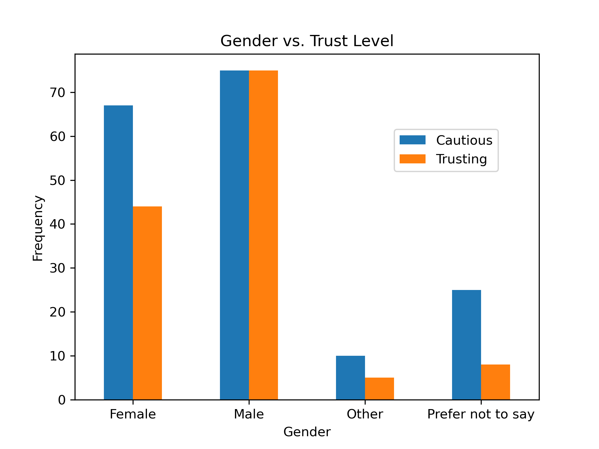
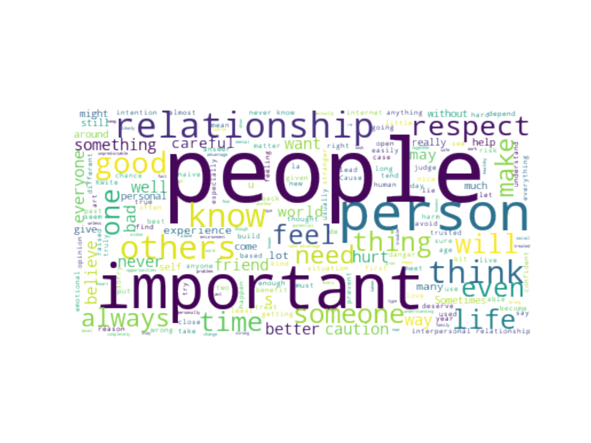

# Trust vs Caution

A small sample of data was collected to understand the why some people may be trusting or cautious in their approach to interpersonal relationships.

The dataset is contained in the file 'Interpersonal Relationships Research 2.csv'

An ipython notebook that examines the spread of the data across across age, gender, etc. is available in the file 'Trust_vs_Caution.ipynb'

The relevant graphs are also stored as png images in this folder.

This dataset was originally a small sample of 99 participants, but additional data was collected to help identify potential trends. The final sample accounted for a total of 309 participants. In general, it should be noted that this sample size is still too small to draw definitive conclusions.

The participants were asked to answer the following questions?
* What is your Age?

_The following age groups were given as choices:_

| less than 18 | 18-25 | 26-35 | 36-50 | 50 and above |
| --- | --- | --- | --- | --- |

* What is your Gender?

_The following gender choices were given:_
  
| Male | Female | Other | Prefer not to say |
| --- | --- | --- | --- |

* With respect to interpersonal relationships, would you describe yourself as trusting or cautious?	

_The following choices were given:_
  
| Trusting | Cautious |
| --- | --- |

* Based on your previous answer, why do you think it is important to be trusting or cautious with respect to others? (Be as detailed as you like in your response)

### Here is a small excerpt of the data contained in the file "Interpersonal Relationships Research 2.csv"

| What is your Age? | What is your Gender? | With respect to interpersonal relationships, would you describe yourself as trusting or cautious? | Based on your previous answer, why do you think it is important to be trusting or cautious with respect to others? (Be as detailed as you like in your response) |
| --- | --- | --- | --- |
| 26-35 | Male | Trusting | I see that it is important to be a little of each, as healthy as possible, without excesses. I believe the key is to be careful until you know you can trust the person completely.|
| 18-25 | Female | Cautious | There are so many different motivations people have, and with them, many different opportunities for them to want to hurt others. It's safer just to avoid people who ask anything of you, just in case that leads to them taking advantage of you. |
| less than 18 | Male | Cautious | Personally I just have trouble trusting people, and think that caution is important in any relationship, it keeps you prepared for, if someone does something you have explicitly stated your against or when they display red flags. |
| 18-25 | Female | Trusting | Unless that other is my very close friend, I wouldn't be that trusting. Trust is very important in gaining relationships with others, no man is an island after all.. One way on another, a person is going to need help and they can't achieve that if they're too cautious |
| 36-50 | Female | Trusting | If you are always cautious and trust no one, then you will always be in the mind set of uneasiness, untrusting, and the worse feeling of all... alone. We may need alone time, but nobody truly wants to be alone. I have found with having trust in my partner, I am no longer alone and life is a lot easier, especially in raising the kids. Prior, there was no trust and a lot of abuse. |
| 26-35 | Other | Cautious | Because we live in a world where everything is perceived as survival of the fittest. Trusting others can be at a detriment to one's own health, especially when you factor in things like race and SO. |
| less than 18 | Prefer not to say | Trusting | I feel it's important to show trust so the other person feels more comfortable in whatever relationship you have with the person, and so you don't have any sort of tension that can ruin the relationship before it even really starts. But being cautious is just as understandable if you've been too trusting in past relationships. |
| 18-25 | Male | Cautious | Everyone is different. Some prefer quick decisive or even brutal honesty while others may be more akin to a lighter approach. At the end of the day it all depends on who is involved. Its important to be trusting for we truly only receive as much as we give in most respects, but being trusting to a fault is in itself a problem. Which is why a healthy blend of trust and caution is often required to service all parties involved the same respect and grace. Its important to exercise both sides to an extent for us to grow as people and hopefully grow our circle of trust alongside that. |

# General Discussion

Due to the relatively small size of the sample, the specfics of the data are not of great consequence and as such I think an informal discussion is more appropriate here. Many of the participants felt as though trust is important, as it allows a person to build a relationship much easier; on the other hand, many beleived that it is easy to get hurt in relationships and that consequently, caution is more advisable than trust when approaching relationships. The style of approach to relationships as it concerns caution and trust seemed to be relatively evenly split among the participants, with a small majority of 177 people describing themselves as cautious, while the remaining 132 people described themselves as trusting.

The graphs below show the relationship between trust, age and gender. 

  
  

Across different age groups their is little to no significant variation between the choice of trust versus caution. Likewise, across genders, there does not seem to be any significant trends in the data. In fact, the most alarming feature of this dataset is how evenly split the participants choices seem to be alongside the strong opinions that people have presented in tandem with their views. It is important to note that this dataset is relatively small, but based on the information here, it's difficult to imagine a scenario where a persons approach (being more trusting or more cautious) does not in fact present a compatibility issue at the outset of relationship. Of course, the complexity of any psychological phenomenon makes it difficult to make definitive statements, but at the very least I think that the data here does give great precedent for further investigation.

It should be noted that many of the particpants spoke about the importance of being both trusting and cautious, and as such I beleive that an ordinal level of measurement featuring a spectrum across trust and caution would be much better suited for collecting information on this issue.

The following word cloud was generated from the responses the participants gave. The word frequency chart that illustrates the data itself is on the right. (The frequency graph is very detailed and will require enlargement to properly view.)

  
  

